# Meals Application

## Description
Welcome to Meals App – your ultimate destination for discovering, preparing, and savoring delicious meals worldwide. Whether you're an aspiring chef or simply looking for new culinary adventures, our app has you covered.

 

## Features
- **Onboarding:** The onboarding process helps new users quickly understand and use our app by introducing them to its main features through a series of screens. It aims to make the app user-friendly, encourage exploration, and highlight its value from the start.
  

  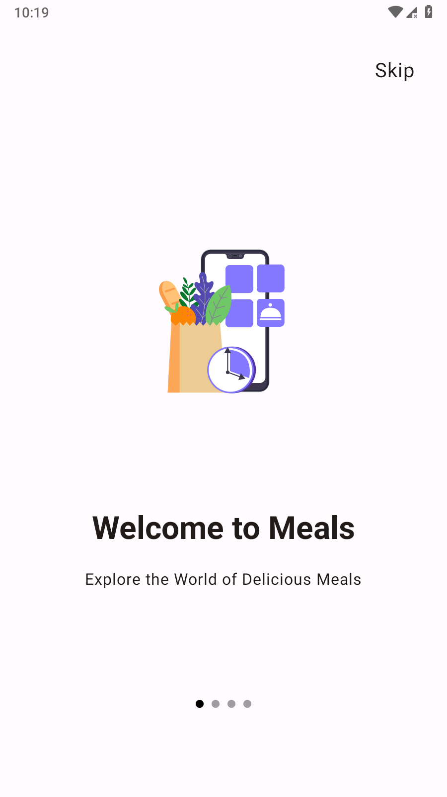
  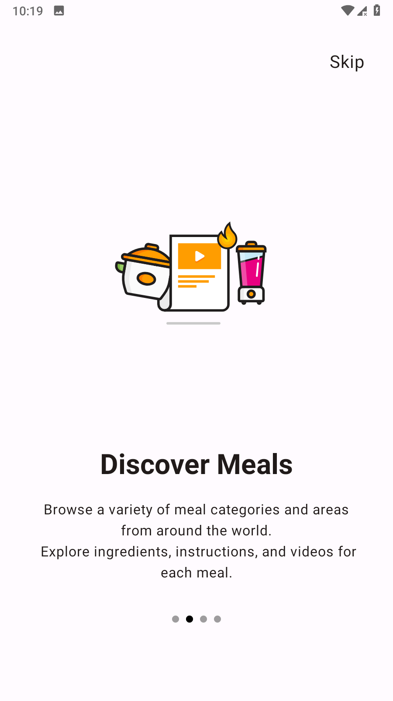
  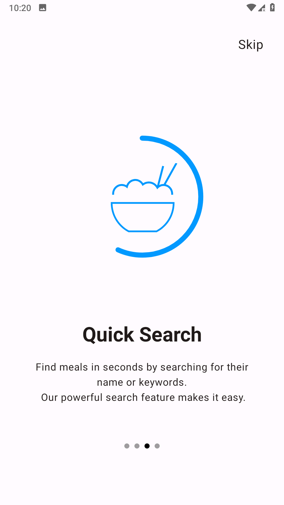
  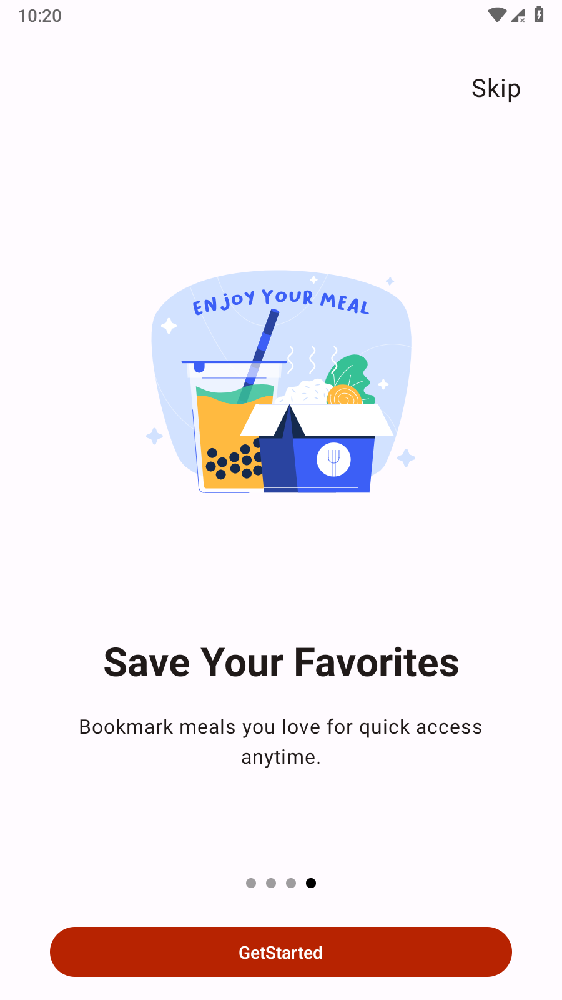

- **Meal Categories and Areas:** Explore a diverse range of meal categories and regions to find the perfect dish for any occasion.
  

    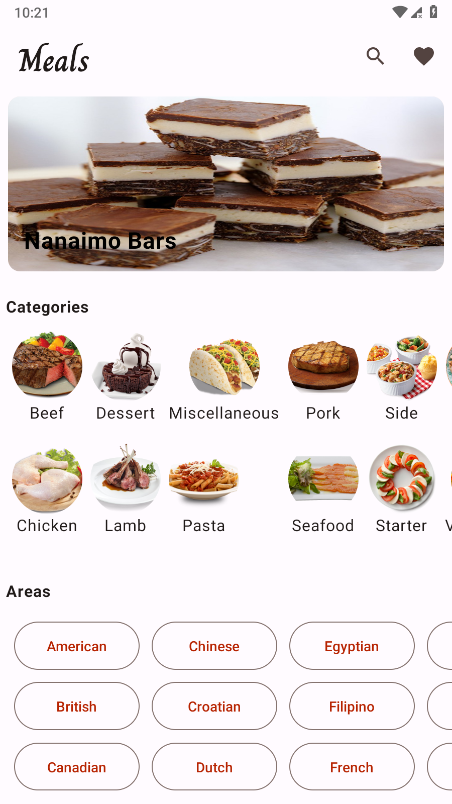
    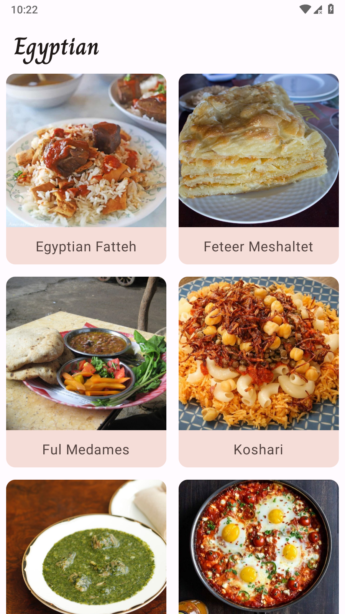
  

  
- **Detailed Meal Information:** Access comprehensive details, including ingredients, instructions, and videos, for each meal.
  

    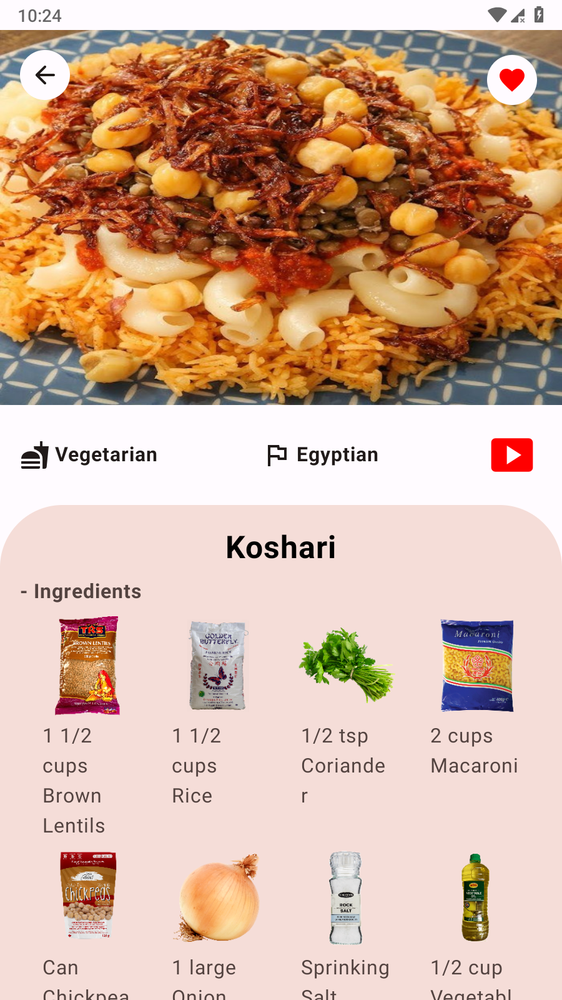
    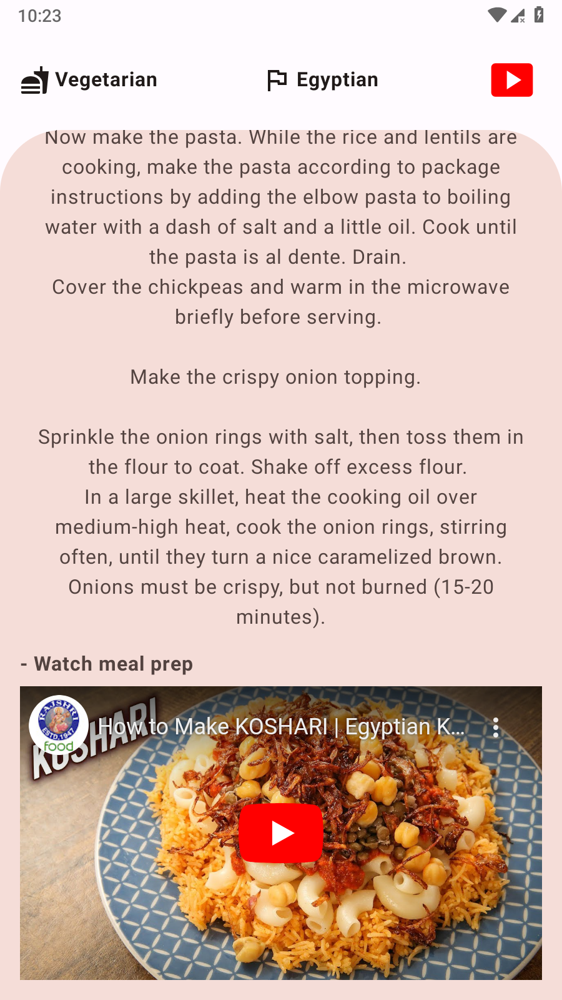
  

  
- **Effortless Search:** Quickly find your favorite meals by name or keywords with our robust search functionality.
  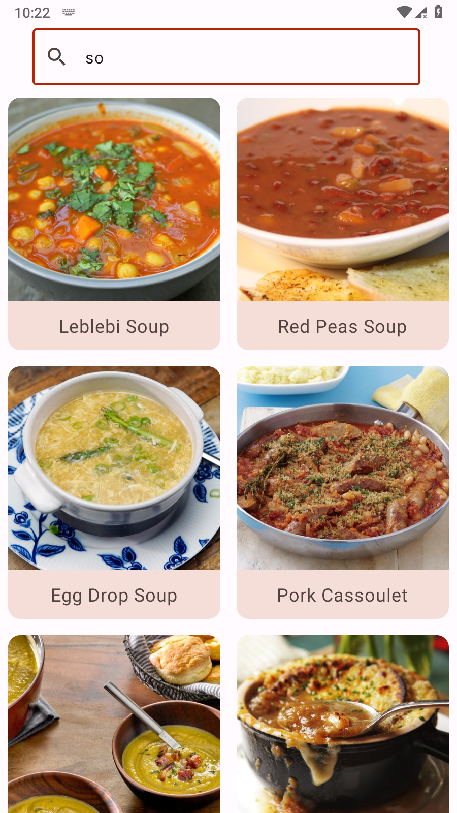
  
- **Favorites and Bookmarking:** Save and organize your favorite meals for easy access and personalization.
  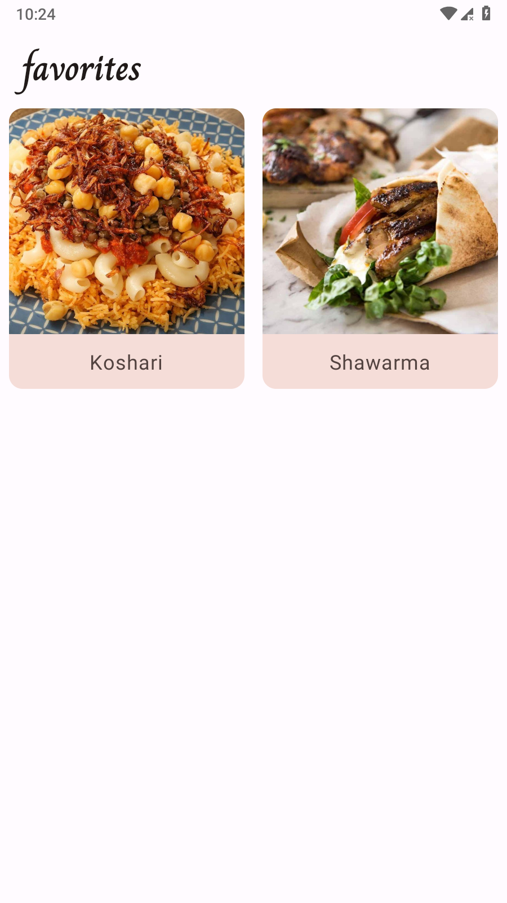
  
- **Network Handling** When using Meals Application, you can easily check your network status. The Application will inform you whether you are connected to the internet or not. This ensures a seamless experience even in challenging network conditions.
  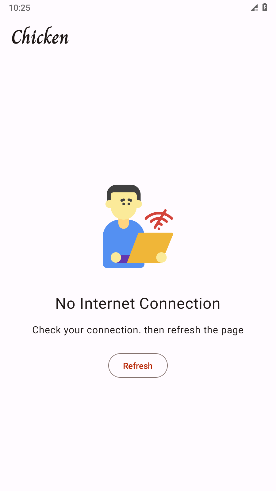

 

## Getting Started

To run Meals application locally:
1. Clone this repository: `https://github.com/Sobhy-Abdelhakam/Meals.git`
2. Open the project in Android Studio.
3. Build and run the application on an emulator or a physical device.

 

## Dependencies

Meals relies on the following key dependencies:

* [Jetpack Compose](https://www.jetpackcompose.net)
* [Retrofit](https://github.com/square/retrofit)
* [Room DataBase](https://developer.android.com/training/data-storage/room)
* [Coroutines](https://developer.android.com/kotlin/coroutines)
* [Model-View-ViewModel(MVVM)](https://developer.android.com/topic/libraries/architecture/viewmodel)
* [Coil](https://coil-kt.github.io/coil/)
* [Flows](https://developer.android.com/kotlin/flow)
* [UI State](https://developer.android.com/topic/architecture/ui-layer/stateholders)
* [Dependency injection with Hilt](https://developer.android.com/training/dependency-injection/hilt-android)
* [Lottie](https://github.com/airbnb/lottie-android)
* [DataStore Preferences](https://developer.android.com/codelabs/android-preferences-datastore)
* [Clean Architecture](https://www.raywenderlich.com/3595916-clean-architecture-tutorial-for-android-getting-started)

For a complete list of dependencies, please refer to the `build.gradle` files.

 

## Server API I Use

* [Themealdb](https://www.themealdb.com/)

